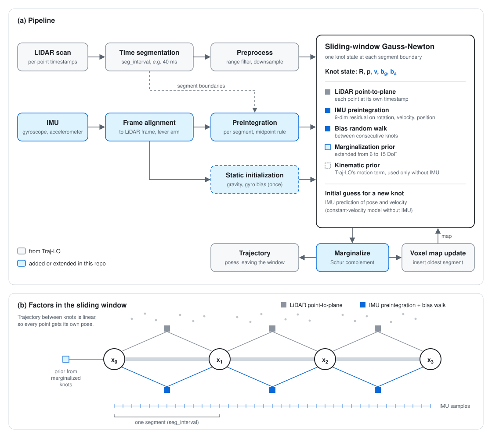

# Traj-LO-IMU

**Traj-LO with IMU preintegration.** A LiDAR-inertial odometry built on the continuous-time LiDAR odometry [Traj-LO](https://github.com/kevin2431/Traj-LO), adding IMU preintegration factors to its sliding-window optimization for better robustness in geometrically degenerate scenes.

> [!IMPORTANT]
> This is an **unofficial** extension of Traj-LO (Xin Zheng and Jianke Zhu). It is **not** the implementation or a reproduction of
> [Traj-LIO (Zheng & Zhu, 2024)](https://arxiv.org/abs/2402.09189), which estimates a sparse Gaussian-process trajectory for multi-LiDAR multi-IMU systems.
> This repository keeps Traj-LO's piecewise-linear trajectory and only adds IMU preintegration. There is no new method here; credit for the core LiDAR odometry goes to the original authors.

## Framework

<p align="center">
  
</p>

**Trajectory model (from Traj-LO).** The incoming scan is cut into short time segments (`seg_interval`, e.g. 40 ms). One state, called a *knot*, sits at each segment boundary, and the trajectory between two knots is linear in SE(3). Every LiDAR point is therefore registered with the pose at its own timestamp, without a separate deskewing step.

**What this repository adds:**

1. **Knot state.** Each knot holds rotation, position, velocity, gyroscope bias and accelerometer bias (15 DoF). Without IMU it falls back to pose only (6 DoF).
2. **IMU data path.** IMU messages are read from the same rosbag, rotated into the LiDAR frame, and corrected for the centripetal lever-arm term.
3. **Static initialization.** During the first `init_time` seconds the platform must be static. Gravity is taken from the mean accelerometer reading (its measured magnitude, not a fixed 9.81) and the gyroscope bias from the mean gyroscope reading.
4. **Preintegration.** For each segment, IMU samples are preintegrated with the midpoint rule (Forster et al., TRO 2017). Virtual samples are interpolated exactly at both segment boundaries. Bias changes use first-order correction Jacobians.
5. **Factors in the window.**
   - LiDAR point-to-plane against a voxel map (from Traj-LO).
   - IMU preintegration, a 9-dim residual on rotation, velocity and position.
   - Bias random walk between consecutive knots.
   - Marginalization prior, extended from 6 to 15 DoF.

   When a segment has an IMU factor, that factor **replaces** Traj-LO's kinematic prior (the constant-motion term) for the segment. Without IMU, or before initialization, Traj-LO's original terms are used unchanged.
6. **Prediction.** The IMU prediction gives the initial pose and velocity of each new knot.

The window is solved with Gauss-Newton. The oldest knot is then marginalized by Schur complement, and its segment's points are inserted into the voxel map.

## Build

Tested on Ubuntu 20.04. ROS is **not** required: rosbags are read directly.

```bash
git clone https://github.com/qiyu-lu/Traj-LO-IMU.git
cd Traj-LO-IMU
./scripts/install_deps.sh        # system packages (TBB, Boost, GLFW, ...)
mkdir build && cd build
cmake .. -DCMAKE_BUILD_TYPE=Release
make -j8
```

Eigen, Sophus, yaml-cpp and the other libraries are vendored in `thirdparty/`.
If CMake fails inside oneTBB under a non-English locale, run `export LANG=C LC_ALL=C` first.

Optional unit test for the preintegration Jacobians:

```bash
./test_imu_jacobians
```

## Run

Set `dataset.path` in a config file to your rosbag, then:

```bash
./trajlo ../data/config_lio_legkilo.yaml            # with GUI
./trajlo_headless ../data/config_lio_legkilo.yaml   # without GUI
```

Set `dataset.save_pose: true` to write the trajectory in TUM format to `dataset.pose_file_path`.

### Provided configs

| Config | Dataset | Sensors |
|---|---|---|
| `config_lio_legkilo.yaml` | [Leg-KILO](https://github.com/ouguangjun/Leg-KILO) | Unitree quadruped, Velodyne VLP-16 |
| `config_lio_quadruped.yaml` | Quadruped-SLAM | Unitree Go2, Velodyne |
| `config_lio_diter.yaml`, `config_lio_diter_park.yaml` | DiTer++ | Ouster + built-in IMU |
| `config_lio_ouster.yaml` | Hilti 2021 | Ouster OS0-64 + IMU |
| `config_lio_velodyne.yaml` | SubT-MRS | Velodyne VLP-16 + IMU |

The configs without `lio` in their name (`config_livox.yaml`, `config_ouster.yaml`, ...) are Traj-LO's original LiDAR-only configs and still work.

### IMU configuration

The IMU path is enabled by an `imu` section. Without it, the code runs as plain LiDAR-only Traj-LO.

```yaml
calibration:
  time_offset: 0.0           # added to IMU timestamps [s]
  T_body_lidar: [...]        # LiDAR -> IMU extrinsic: p_imu = R * p_lidar + t

imu:
  enabled: true
  topic: "/imu_raw"
  sigma_ng: 5e-2             # gyroscope noise density
  sigma_na: 5e-1             # accelerometer noise density
  sigma_bg_rw: 1e-4          # gyroscope bias random walk
  sigma_ba_rw: 1e-3          # accelerometer bias random walk
  imu_weight: 0.1            # global LiDAR vs. IMU balance
  init_time: 0.8             # static initialization span [s]
```

### Tips

- **Start static.** The first `init_time` seconds are used for initialization. A warning is printed if the gyroscope was clearly moving.
- **Noise values.** The provided noise densities are deliberately inflated, because foot impacts on legged robots act as unmodeled vibration. On wheeled or handheld platforms, values closer to the IMU datasheet may work better.
- **Per-point timestamps** are required, as in Traj-LO.
- For aggressive motion, decrease `seg_interval`.

## Results

Quantitative results are being prepared and will be added here. So far, the main benefit we observe is **robustness**: on legged-robot sequences where LiDAR-only Traj-LO diverges, such as stairwells, the IMU version converges.

## Fixes to the upstream code

Two bugs in the original Traj-LO code are fixed here and apply to the LiDAR-only mode as well:

- **Data race in `MapManager::PointRegistrationNormal`.** Variables shared across the TBB `parallel_reduce` were overwritten by the first-estimate-Jacobian branch, which also corrupted residuals and data association.
- **Use-after-free in `TrajLOdometry::Marginalize`.** The window key was held by reference into a map node that was then erased.

## Acknowledgement

This work is built entirely on [Traj-LO](https://github.com/kevin2431/Traj-LO). If you use it in academic work, please cite the original paper:

```bibtex
@ARTICLE{zheng2024traj,
  author  = {Zheng, Xin and Zhu, Jianke},
  journal = {IEEE Robotics and Automation Letters},
  title   = {Traj-LO: In Defense of LiDAR-Only Odometry Using an Effective Continuous-Time Trajectory},
  year    = {2024},
  volume  = {9},
  number  = {2},
  pages   = {1961-1968},
  doi     = {10.1109/LRA.2024.3352360}
}
```

The IMU preintegration follows C. Forster et al., *On-Manifold Preintegration for Real-Time Visual-Inertial Odometry*, IEEE TRO 2017.

## License

MIT, same as Traj-LO. The original copyright notice is kept in [LICENSE](LICENSE). Libraries in `thirdparty/` keep their own licenses.
